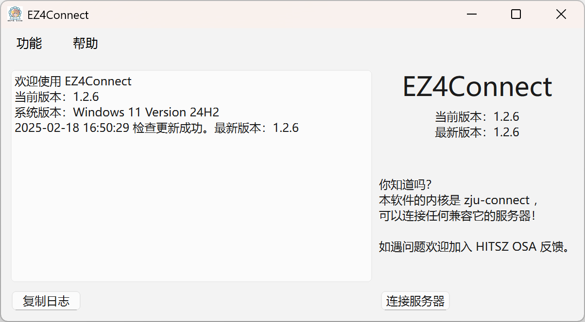
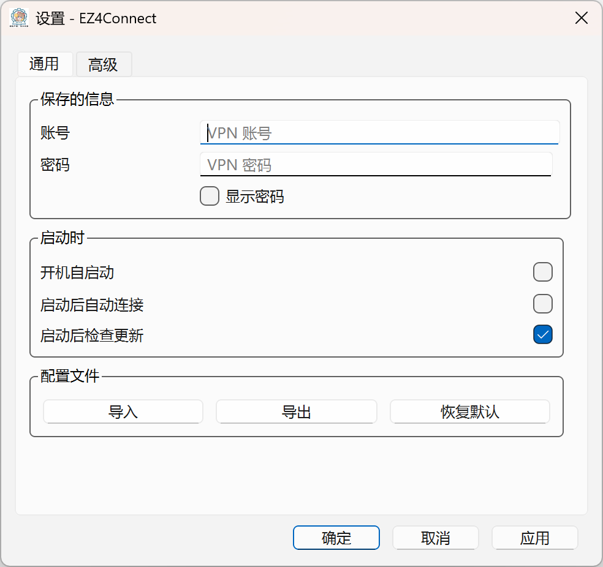

# EZ4Connect

*前身为 HITsz Connect for Windows ，将在下一个版本更新后更名仓库*

改进的 ZJU-Connect 图形界面

欢迎加入 HITSZ 开源技术协会 [@hitszosa](https://github.com/hitszosa)

## 使用方式

1. 在本项目的 [Releases](https://github.com/PageChen04/HITsz-Connect-for-Windows/releases) 页面下载最新版本：

- **Windows 用户**：下载 `EZ4Connect-vX.X.X-windows-ARCH.zip` ，解压至同一目录下，双击运行 `EZ4Connect.exe` ；
  - 如果遇到缺少 DLL 等问题，请先下载安装 Microsoft Visual C++ 可再发行程序包版本（[x64](https://aka.ms/vs/17/release/vc_redist.x64.exe) | [arm64](https://aka.ms/vs/17/release/vc_redist.arm64.exe)），再运行程序；
- **macOS 用户**：下载 `EZ4Connect-vX.X.X-macOS-ARCH.dmg` ，按照镜像内部指示安装，并运行修复脚本；
  - 如果你遇到“Apple 无法检查 App 是否包含恶意软件”等报错，请参考： [Apple 支持](https://support.apple.com/zh-cn/guide/mac-help/mchleab3a043/mac)
- **Linux 用户**：下载 `EZ4Connect-vX.X.X-linux-ARCH.AppImage` ，赋予执行权限，运行即可；
  - AppImage x64 仅支持系统 `glibc >= 2.31` 的发行版，Ubuntu 20.04 及以上版本可以正常运行（受限于 GitHub Actions Runner）；
  - AppImage arm64 仅支持系统 `glibc >= 2.38` 的发行版，Ubuntu 24.04 及以上版本可以正常运行（受限于 Qt 官方：[参考](https://doc.qt.io/qt-6/supported-platforms.html)）；
  - Arch Linux 用户请等待 AUR 包的提交（欢迎热心用户自行上传）；
  - 如果遇到因依赖问题无法运行的情况，请自行编译运行。

2. 在 “功能”-“设置”-“通用” 页面中输入账号（一般为学号）和密码，点击 OK 保存登录信息；

3. 在主界面中点击“连接服务器”。在默认配置下，若连接正常，软件中日志会显示 `KeepAlive: OK` ；

4. 如果只需进行校园网页浏览，则选择“设置系统代理”后即可使用。

如果需要配合 Clash / Mihomo 进行高级的分流操作，可以参见： [高级使用方式](docs/ADVANCED_USAGE.md)

## 适配指南

本项目为了便于构建专用于其他可以使用 ZJU-Connect 的学校（如：HITSZ）的版本，特别提供了适配指南。

- 程序中引用的应用名称均来自头文件 `utils/utils.h` 中的 `Utils::APP_NAME` ，仓库由同个头文件中的 `Utils::REPO_NAME` 定义；
- CI 配置 `build.yml` 中，`env.TARGET_NAME` 应当与 CMake 项目名称一致，`env.DISPLAY_NAME` 定义了编译结果的文件夹 / 应用名称；
- 默认配置则规定于 `zjuconnectmode.cpp` 和 `settingwindow.cpp` 中。

如有需要，可以自行修改适配。

## 路线图

如有更多好的建议，可以在 Issue 中或是 OSA 群里提出！

- [X] 简化更名流程
- [X] 支持 macOS 系统
- [X] 支持 Linux 系统
- [X] 支持手动设置 Proxy Bypass
- [ ] 上传 AUR 包

## 相关项目

以下均为 EasyConnect 客户端的桌面友好替代品，可按需使用：

- [kowyo/hitsz-connect-verge](https://github.com/kowyo/hitsz-connect-verge): 轻量级的 ZJU-Connect 客户端，基于 PyQt ，支持 Windows 和 macOS ，面向 HITSZ 用户
- [Mythologyli/ZJU-Connect-for-Windows](https://github.com/Mythologyli/ZJU-Connect-for-Windows): 基于 Qt 的 ZJU-Connect 客户端，本项目的前身，支持 Windows ，面向 ZJU 用户
- [docker-easyconnect/docker-easyconnect](https://github.com/docker-easyconnect/docker-easyconnect): 利用 Docker 隔离的 EasyConnect 客户端

## 致谢

- [Mythologyli/ZJU-Connect-for-Windows](https://github.com/Mythologyli/ZJU-Connect-for-Windows)
- [Mythologyli/zju-connect](https://github.com/Mythologyli/zju-connect)
