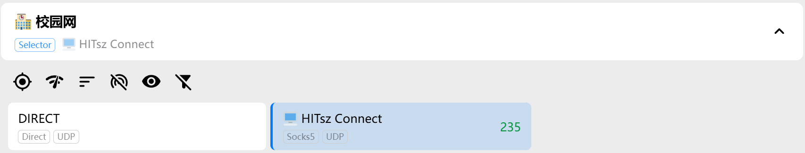

# 高级使用方式

## Clash / Mihomo 分流配置

若需要使用 Clash、Mihomo 等其他代理软件与本软件配合分流，可以采用以下两种方式之一：

1. **本软件作为主代理**：开启本软件的系统代理功能，将本软件认为不需要代理的流量通过“直连代理”转发给 Clash 或 Mihomo。
2. **Clash/Mihomo 作为主代理**：关闭本软件的系统代理功能，将需要本软件代理的流量转发到本软件。

以下是具体操作流程：

### 方式一：本软件作为主代理

- 在“功能”-“设置”-“核心” 页面中设置“直连代理”为 Clash 等软件监听的端口（以 7890 为例 http://127.0.0.1:7890）；
- 注意勾选“允许外部访问”；
- 开启本软件的系统代理；
- 启动 Clash 时不需要打开系统代理或 TUN，即可正确转发流量。

<div align="center">

</div>

### 方式二：Clash 作为主代理

- 清空本软件的系统代理；
- 在 “功能”-“设置”-“核心” 页面中设置 SOCK5 的代理端口（以 11080 为例），以下为推荐配置：

在 Clash 的代理配置中添加一个代理服务器：

```yaml
# 代理服务器
proxies:
  - name: 🖥 EZ4Connect
    type: socks5
    server: 127.0.0.1
    port: 11080
    udp: true
```

并在代理组中添加一个单独的代理组：

```yaml
proxy-groups:
  - name: "🏫 校园网"
    type: select
    proxies:
      - DIRECT
      - 🖥 EZ4Connect
```

并在规则中加入：

```yaml
rules:
  - DOMAIN,vpn.hitsz.edu.cn,DIRECT
  - DOMAIN-SUFFIX,hitsz.edu.cn,🏫 校园网
  - IP-CIDR,10.0.0.0/8,🏫 校园网,no-resolve
  # 可在此添加其它你需要代理的 ip 段，如课程中心
```

这样即可通过简单的切换实现在校外使用本项目时选择 EZ4Connect 代理，在校内使用 DIRECT 直连。

<div align="center">

</div>

## TUN 模式

（这里是个坑，没填的坑）
